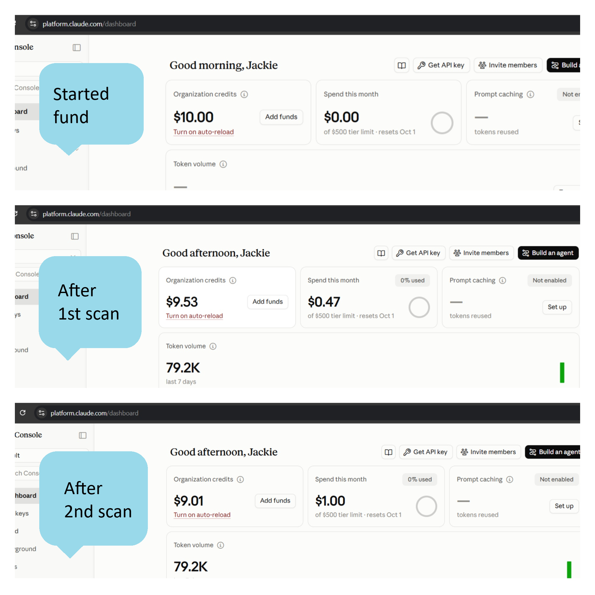

# E-Commerce GRC Security Audit

A self-directed **GRC (Governance, Risk & Compliance) health check** of my own live WordPress/WooCommerce store. A Python tool pulls live configuration from Cloudflare, Hostinger, WordPress, and WooCommerce, compares it against my written security policy, and produces a color-coded report for non-technical readers.

I ran it twice: once to find gaps, and once after fixing them to see what actually changed. The whole project cost **$0.99** in API fees.

> **Scope note:** This is a personal project on infrastructure I own. It is **not** a NIST or PCI DSS certification. No Qualified Security Assessor (QSA) was involved, and payment-gateway configuration was intentionally excluded. The domain and account identifiers in this repo are redacted or replaced with placeholders.

**Live reports:** [View Scan 1](https://jackie-projects.github.io/ecommerce-grc-security-audit/scan-1-report.html) · [View Scan 2](https://jackie-projects.github.io/ecommerce-grc-security-audit/scan-2-report.html)

---

## Why I built this

I run a small e-commerce site and wanted a repeatable way to answer: *"Is my setup actually as secure as my policy says it is?"* Security guidance changes (NIST updates, Cloudflare feature changes) and my own site changes (new plugins, new settings), so a one-time check goes stale. This tool is meant to be re-run periodically as a self-check, so I can see which areas need attention before something goes wrong.

---

## Results: Scan 1 vs. Scan 2

| Area | Scan 1 | After fixes / Scan 2 |
|---|---|---|
| HTTPS enforcement at the edge | Confirmed failure (`always_use_https = off`) | Confirmed enabled |
| TLS mode | Full (origin certificate not validated) | Full (Strict) |
| HSTS | Enabled, subdomains not covered | Subdomains included |
| Cloudflare "security level" | Flagged as High severity | Corrected: reclassified as informational (see below) |
| WAF custom rules | Inconclusive (API error) | Manually confirmed: 5 custom rules active (Free plan) |
| Incident Response Plan | Referenced in policy, not attached | Written and linked from policy |
| Written policy | SEC-POL-v2.1 | SEC-POL-v2.2 (gaps in inventory, monitoring, recovery, and governance closed) |
| WordPress/WooCommerce telemetry | Failed (URL missing `https://`) | Collector fixed, but now blocked by a Cloudflare bot challenge (see below) |

You can diff the two policy versions directly: [`SEC-POL-v2.1.md`](./SEC-POL-v2.1.md) vs. [`SEC-POL-v2.2.md`](./SEC-POL-v2.2.md). The v2.2 change log maps every edit back to the audit finding it resolves.

---

## What I learned when the tool was wrong

The most useful part of this project wasn't a finding. It was catching the tool's own mistake.

### 1. Cloudflare changed what "security level" means

The audit flagged `security_level = essentially_off` as a **High-severity** weakness. When I went to fix it, I found Cloudflare no longer offers a security-level selector in the dashboard. After checking Cloudflare's current documentation, I confirmed the setting has been restructured: it now effectively controls only **Under Attack Mode**, a DDoS-specific challenge mode. `essentially_off` just means that mode is off, which is normal for a site not under attack. General edge protection comes from WAF rules, not this field.

So the report overstated the risk, based on an outdated understanding of a vendor setting. Rather than quietly deleting the finding, I documented the correction in an **auditor addendum** (Section 16 of the report) and withdrew the related remediation item.

**Takeaway:** automated analysis, including AI-assisted analysis, can misread vendor-specific semantics. Findings need human verification against primary sources, and vendors redefine settings over time.

### 2. A deprecated API looks like a permissions error

The WAF check returned HTTP 403 "Authentication error." That turned out to be Cloudflare's legacy firewall-rules API, which was retired in favor of WAF custom rules and the Rulesets API. Treating the failed call as "no WAF" would have been wrong, so the report marked it **UNKNOWN**, and I verified the 5 rules manually in the dashboard.

### 3. My own hardening blocked my own scanner

After fixing the collector's URL bug, the WordPress/WooCommerce calls started returning a Cloudflare bot-challenge page (HTTP 403) instead of reaching WordPress at all. My own edge protection now intercepts the audit tool's automated requests. That's a decent sign the protection works, but it means the collector needs a scoped exception (for example an allow rule for the scanner) to restore visibility. That's on the roadmap below.

### The evidence rule that made this possible

Every finding is labeled **Confirmed**, **Assumption/Inference**, or **UNKNOWN**. A failed API call is never treated as a failed control, and never as a passing one. That rule is why the wrong findings above were easy to spot and correct.

---

## Cost

| Run | API cost |
|---|---|
| Scan 1 (baseline) | $0.47 |
| Scan 2 (after fixes) | $0.52 |
| **Total** | **$0.99** |

Each run calls the Anthropic API for two analysis passes (policy alignment and live-environment review). At roughly fifty cents a run, a periodic self-audit is cheap compared to a paid assessment, though it is not a substitute for one.



---

## How it works

1. **Policy review:** the written policy (`SEC-POL-v2.2.md`) is checked clause by clause against a 24-control baseline (`grc_control_baseline.json`) organized by the NIST CSF 2.0 functions: Govern, Identify, Protect, Detect, Respond, Recover.
2. **Live telemetry:** the script queries the Cloudflare, Hostinger, WordPress, and WooCommerce APIs for actual configuration.
3. **Gap synthesis:** policy and live findings are combined into one report with a prioritized remediation plan.
4. **Output:** a Markdown report (git-friendly) and a styled HTML report (easy to read) are generated on every run.

The control baseline is a **custom internal baseline informed by** NIST CSF 2.0 and PCI DSS 4.0. It is not either framework's official control set.

---

## Repository contents

| File | Purpose |
|---|---|
| [`grc_audit.py`](./grc_audit.py) | The audit tool |
| [`SEC-POL-v2.1.md`](./SEC-POL-v2.1.md) / [`SEC-POL-v2.2.md`](./SEC-POL-v2.2.md) | Security policy before and after the first audit |
| [`incident-response-plan.md`](./incident-response-plan.md) | Incident Response Plan referenced by the policy |
| [`scan-1-report.html`](./scan-1-report.html) | Scan 1 report: the baseline, before fixes |
| [`scan-2-report.md`](./scan-2-report.md) / [`scan-2-report.html`](./scan-2-report.html) | Scan 2 report after fixes, including the auditor addendum (Section 16) |
| [`grc_control_baseline.json`](./grc_control_baseline.json) | The 24-control baseline |
| `requirements.txt`, `.env.example`, `.gitignore` | Setup files. Real credentials live in `.env`, which is never committed |


---

## How to run it

```bash
git clone https://github.com/jackie-projects/ecommerce-grc-security-audit
cd ecommerce-grc-security-audit
python -m venv venv
venv\Scripts\activate          # Windows (use: source venv/bin/activate on Mac/Linux)
pip install -r requirements.txt
copy .env.example .env         # then fill in your own credentials
python grc_audit.py
```

You'll need your own Anthropic, Cloudflare, Hostinger, and WordPress credentials. Each run makes paid API calls (about $0.50 in my runs). Raw output files are git-ignored because they can contain unredacted live data.

---

## Roadmap

- Query the Cloudflare **Rulesets API** so WAF rules are verified automatically instead of manually
- Add a scoped allow rule so the collector can reach WordPress/WooCommerce through the bot challenge
- Compare runs automatically to show a trend across scans, not just a snapshot
- Re-run when NIST publishes updates, when Cloudflare changes features, and after any major site change

---

## Skills demonstrated

Python and REST API integration (Cloudflare, Hostinger, WordPress/WooCommerce), GRC frameworks (NIST CSF 2.0, PCI DSS 4.0 concepts), security policy writing and version control, incident response planning, evidence-based reporting, verifying automated findings against vendor documentation, and secrets hygiene (`.env`, `.gitignore`).

---

## Disclaimer

This is a personal, self-scoped assessment. It is not a professional security audit, penetration test, or compliance certification and should not be relied on as one. No credentials, tokens, or real account identifiers are included in this repository.
